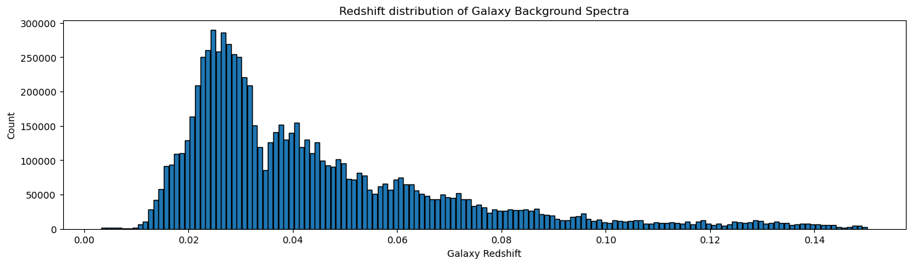
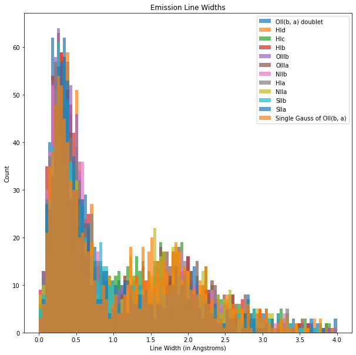
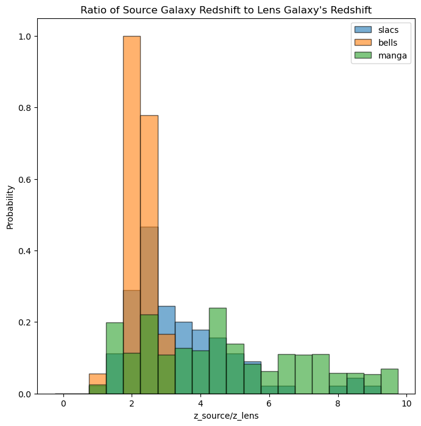

# Computational Methods

## Referenced Files

### a.) manga-wave.npy

- Wavelength of flux values measured by the BOSS spectrographs used by MaNGA
- length = 4563, range = [~3621.6, ~10353.8] Angstroms.

### b.) speczall.fits

- List of all plate-IFU combinations.
- Used to get background spectra used in synthetic data generation.

### c.) config.py

- Referece file for information used in calculations across many files / processes.
  - emission line names + wavelengths, redshift bins, possible SNRs to be generated, number of spectra to put in each dataset, directory paths, etc.

## Step 1.) Get Backgrounds

The "1_get_backgrounds.py" script uses SDSS's speczall.fits file, which provides all plate numbers and ifu design numbers. These numbers are then used to retrieve the speactra for each fiber on a plate, from which the modeled foreground object is subtracted out and the background (noise) is then saved into the appropriate redshift binned text file.
These backgrounds are later used to generate the syntetic spectra used in training.

In this script, a "galaxy_distribution" numpy array is also created and saved, which contains the redshifts of all foreground galaxies present in the catalogue.

    get_backgrounds(Plate number, IFU design)

    Save all background spectra for a given plate-ifu combination into the appropriate text file by combining information from SDSS's specz file and rss file.

## Step 2.) Synthetic Data Generation

"synthetic_data_gen.py" contains classes and functions that generate synthetic data to be used in the process of training the CASIGLO neural network.

### a.) The Data Generation Class

This class has 3 helper functions and one main function that generates synthetic spectra.

The first helper function is the "remove_peaks" function.

    remove_peaks(background, size=200, std_mutliplier=3, passes=2):

    This function removes any spikey features from the input background array by using a rolling window of size=200 that does not overlap itself. The mean and standard deviation of flux values inside the window are computed. Then, if any flux values inside that window fall outside 3 standard deviations from the mean, they are replaced with random values within 1 standard deviation.

This function is applied to the backgrounds in order to help the neural network more easily detect which peaks/spikes are actual emission lines and where those lines are located for different redshift values. Any peaks not removed could be misinterpreted, leading to errors in the model.

Next, is a simple helper function, "get_random_background", that is used to retrieve a single background array from a specified text file.

Lastly, "get_single_line" takes a specified emission line name and redshift and generates a guassian at the correct location.
However, when generating a gaussian, the width of that guassian must also be specified.
When plotting the width of all emission lines detected by SDSS, we can see two main values: one around 0.4 Angstoms and another around 1.7 Angstroms. These 2 widths show up with relative probabilites of about 6-to-1.

So, these two most common values are used when generating synthetic emission lines, and are generated in their relative probabilites of 6/7 and 1/7 respectively.

The main function in this class is the "generate_spectra" function.

    def generate_spectra(self, lines_and_snrs: dict, backgrounds_path: str, z: float) -> ndarray:
        line_names = list(lines_and_snrs.keys())
        SNRs = list(lines_and_snrs.values())

        if len(line_names) != len(SNRs):
            with open(self.output_path) as f:
                f.write(
                    "Length of line_names and SNRs does not match.\nEmpty spectra returned."
                )
            return np.zeros_like(config.manga_wave)

        background = self.get_random_background(backgrounds_path)
        spectra = np.zeros(len(background))
        for i, name in enumerate(line_names):
            line = self.get_single_line(name, z)
            noise_power = float(np.average(background**2))
            amplitude = SNRs[i] * noise_power
            spectra += amplitude * line

        return np.array(spectra + background)

First, a random background is selected and an empty array of the same length is initiallized.
The passed dictionary which contains emission line names and SNRs is then itterated over.
For each ["line name": snr] combo in the dictionary, a gaussian is generated using the "get_single_line" function. Each of these is then added onto the background and the final spectra is returned.

### b.) The Dataset Creation Class

The goal of training the CASIGLO nueral network is to have it be able to detect any combination of emission lines at any redshift BEHIND the redshfit of the lens galaxy and tell us the SNR of those present emission lines.
Knowing this, when generating datasets, we want the neural network to see all combinations of emission lines at many different redhsifts, and to have the emission lines generated at many different SNRs.
Therefore, one dataset is designed to make up a single combination of emission lines at a single foreground redshfit; the SNRs of each emission line, as well as the redshift of the simulated source galaxy, are randomized to help teach the neural network the relations between parameters.
To create these datsets, a "DatasetCreation" class was created, that uses the "DataGeneration" class in order to build the datasets.

Again, this class contains one main function named that uses 3 helper functions.
The "get_snr_combos" function takes in a list of emission line names and creates a list of 20 SNR combinations so that each dataset contains 20 specta.
The "get_background_redshift" function generates a random z value that is between 1.5 - 2.5 times the foreground (lens) galaxy's redshift.

This choice of the factor of 1.5 - 2.5 is supported by the observed ratio of all lensed galaxies from multiple different surveys.

Finally, the "get_labels" function simply generates the labels containing the SNRs and redshift values that will be told to the neural network for training.
The "make_dataset" function combines all of these functions to generate a single HDF5 file with 20 simulated source galaxies, all from 20 different lens galaxies in the same redshift bin.
